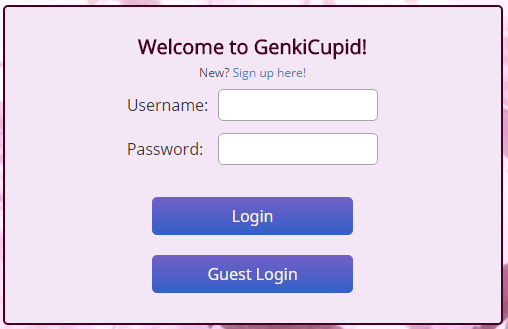
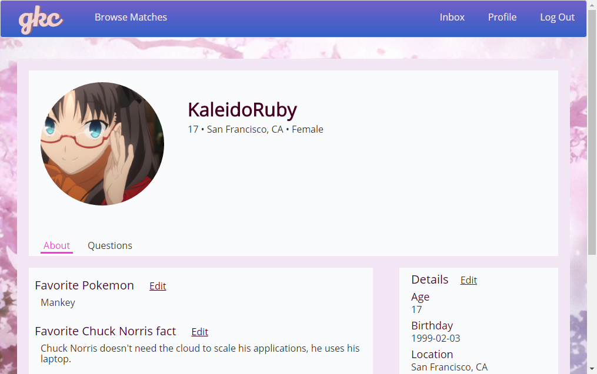
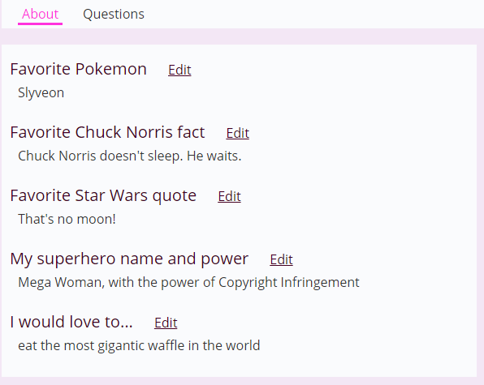
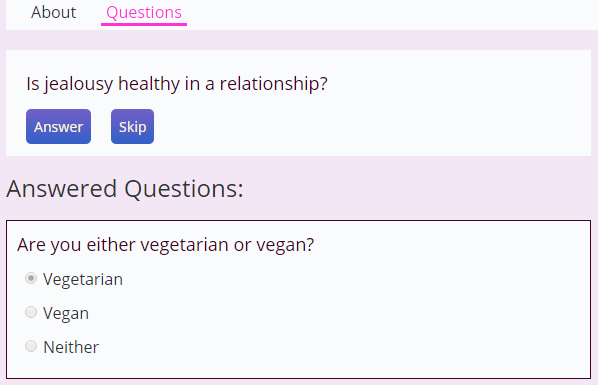
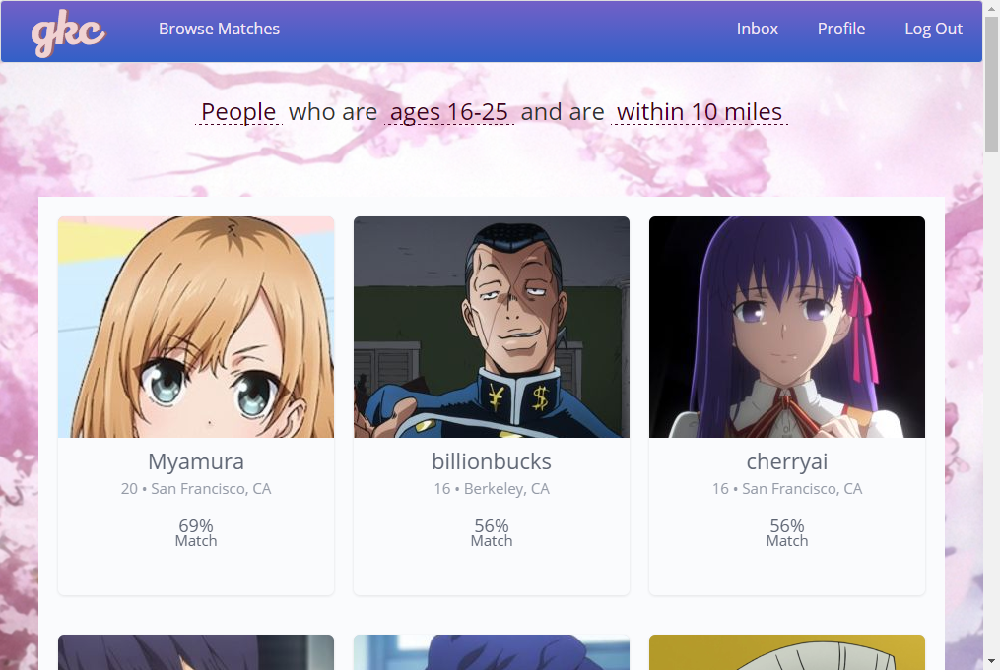
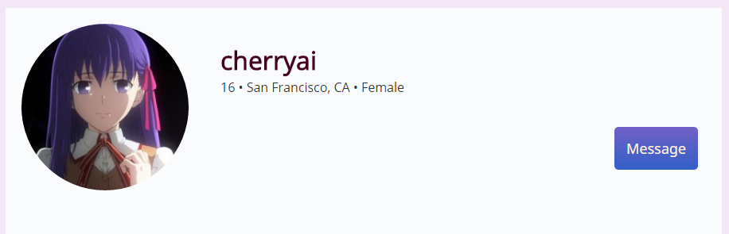
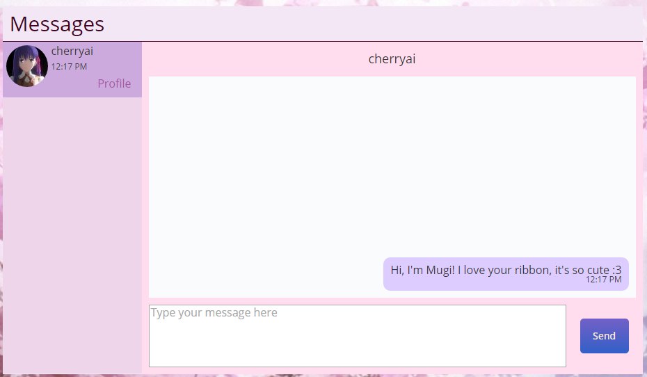

# GenkiCupid

[Live][heroku]

[heroku]: http://genkicupid.herokuapp.com

**GenkiCupid is a roleplay site that combines the matching function of dating websites with the aesthetics of Japanese dating simulators.**

**Build your character's profile and answer personality questions, and GenkiCupid will match you with other characters based on its internal matching algorithm.**

**GenkiCupid is built on a Rails/PostGres backend and React.js frontend using Flux architecture.**

## Features

GenkiCupid's features can only be accessed one you're logged in. For the purpose of checking out the site, a guest login is available.




On signup GenkiCupid asks for a username, password, and some basic details such as birthdate and orientation of the character. Signing up directs you to your profile, where you can upload an avatar image, answer personality questions, and edit your profile details.



GenkiCupid uses Cloudinary image hosting for quick retrieval and server-side cropping and resizing to avoid retrieving unnecessarily large images. Hover over your current avatar and click the button that appears to open the upload widget.


Profile information is separated between freeform personal questions and personality questions used for matching. Clicking the tabs below your avatar switches between these views.



In the Questions view, click on the "Answer" button in the new question field to open up the form to answer the question. Your answers to previous questions appear below the new question field.



Once you've completed the personality questions to your satisfaction, click on "Browse Matches" in the nav bar to see who best matches the answers you've given!

In the Matches view, matches are ordered by their calculated match percentage. Clicking the underlined sections of the header text allows you to change your filter settings by gender, age, and distance. GenkiCupid sets reasonable defaults for these filters when you sign up your character.



If you've found a character you want to interact with, click on their match card to go to their profile. On the profile page, click the "Message" button to compose a message to that user.



Clicking the message button will automatically redirect you to the messaging interface in the Inbox view and open a conversation with the selected user. The layout of the messaging interface mirrors that of chat clients like Skype and Discord.



## Implementation

The user list has been seeded with characters from several popular Japanese cartoon series (hereafter referred to as "anime"). Character information is stored as a `User` in the `users` table. Each `user` is created with the basic information they supplied at signup, as well as a default `filter`, `avatar_url`, and a `postal_code` randomly selected from San Francisco County zip codes.

User creation triggers a call to the [Geocoder](https://github.com/alexreisner/geocoder) gem to query the Google Maps API for location information based on the supplied zip code:
```ruby
geocoded_by :postal_code do |user, results|
  if geo = results.first
    user.latitude = geo.latitude
    user.longitude = geo.longitude
    user.location = "#{geo.city}, #{geo.state_code}"
  end
end

#only query if postal code has changed or if currently isn't any location data
after_validation :geocode, if: :should_query?
```
After the `user` is stored in the database, the server responds to the user creation request by invoking the success callback with the response data, which logs in the `user`, creating a new session and returning the current user's `id` and `username`. Upon receiving the current user data the frontend will then trigger a redirect to the user's profile page.
```javascript
//query function from API Utility file
signUp (user, success, error) {
  $.ajax({
    url: 'api/users',
    type: 'POST',
    dataType: 'json',
    data: {user},
    success,
    error(xhr) {
      const errors = xhr.responseJSON;
      error("signup", errors);
    }
  });
}
//Request initiator and success callback from SessionActions file
signUp (formData) {
  SessionApiUtil.signUp(
    formData,
    SessionActions.receiveCurrentUser,
    ErrorActions.setErrors);
},  
receiveCurrentUser(currentUser){
  AppDispatcher.dispatch({
    actionType: SessionConstants.LOGIN,
    currentUser: currentUser
  });
}

//error callback from ErrorActions
setErrors(form, errors) {
  AppDispatcher.dispatch({
    actionType: ErrorConstants.SET_ERRORS,
    form: form,
    errors: errors
  });
}
```

To facilitate retrieval of models linked to a higher level model GenkiCupid makes use of nested routes. For example, `essays`, `answers`, and `filters` are nested under `profiles`, so that the entities from those tables linked to the profile being viewed can be easily accessed by querying the route with the `profile_username` of the profile being viewed instead of having to provide extra parameters in the data being sent in the query.
```ruby
Rails.application.routes.draw do
  root to: 'static_pages#root'

  namespace :api, defaults: {format: :json} do
    resources :users, only:[:create]
    resource :session, only:[:create, :destroy]
    resources :profiles, param: :username, only:[:show, :update] do
      resources :essays, only: [:index, :show, :update]
      resources :answers, only: [:index, :show, :update, :create, :destroy]
      resource :filter, only:[:show, :update]
    end
    resources :questions, only:[:show, :index]
    resources :matches, param: :username, only:[:index]
    resources :message_threads, only:[:index, :show, :create] do
      resources :messages, only:[:index, :show, :create, :update, :destroy]
    end
  end
end

```
Note that `profiles` are a separate route from `users`, separating the authorization process from retrieval of profile data. In addition, profiles are routed to by `username`, not user `id`. This means that to see a character's profile you must either access them via navigating the site itself or know the `username` of the character you are attempting to look up, discouraging URL manipulation.

Information retrieval is further organized by the Flux architecture. Data flow is regulated by 9 separate Flux loops. Each loop is solely responsible for receiving user-initiated actions, querying the database in response, and returning the data to the appropriate store. The store then triggers the React pages to update with the returned information. This unidirectional data flow ensures that issues that arise can be easily traced to their origin by following the data back around the loop, easing maintenance of the code.

Each time the user accesses the Matches page, the query to the server will generate a `match` entity with each user in the database not already linked by a `match` object. A `match` is a relational object linking two `users` to each other. It holds the methods responsible for matching users and accessing the profile information needed to display the match card and filter matches.

Match percentages are simple: compare the answers given by the two users to the personality questions, accounting for differences in the number of questions answered by each user.
```ruby
def match_percent
  questions_answered = self.user.answers.length
  if questions_answered == 0
    return 0
  end
  same_answers = 0
  not_answered = 0
  match_answers = self.profile.answers
  if match_answers.length == 0
    return 0
  end
  self_answers = self.user.answers
  self_answers.each do |answer|

    match_answer = (match_answers.select {|ans| ans.question_id == answer.question_id})[0]
    if match_answer == nil
      not_answered += 1
      next
    elsif answer.option_id == match_answer.option_id
      same_answers += 1
    end
  end

  ((same_answers.to_f/(questions_answered - not_answered)).round(2) * 100).to_i
end
```

```ruby
#Attempt to create match with each user in the DB; constraints prevent duplicates so will only create matches with previously unmatched users
def self.make_matches(username)
  user = User.find_by_username(username)
  User.all.each do |match|
    next if user == match
    Match.create(user_id: user.id, match_id: match.id)
  end
end

#retrieves data needed from the linked profile
def profile_details
  this_profile = this.profile
  {
    image: this_profile.avatar_url,
    username: this_profile.username,
    age: this_profile.age,
    gender: this_profile.gender,
    location: this_profile.location,
    distance: distance_away
  }
end

```

When a user initiates communication with another user by clicking the message button, they are redirected to an interstitial page that initiates the creation of a new message thread, if one does not already exist. In either case, upon receiving the response it redirects to the conversation between the two users. Only one thread is allowed to exist between any two users, which is handled by the controller `create` method:

```ruby
def create
  sender_id = current_user.id
  recipient_id = User.find_by_username(params[:username]).id
  if MessageThread.between(sender_id,recipient_id).present?
    #if thread already exists between the current user and user being messaged, pass that thread back in the response
    @message_thread = MessageThread.between(sender_id,
      recipient_id).first
  else
    #create new thread if it doesn't exist
    @message_thread = MessageThread.create(sender_id: sender_id, recipient_id: recipient_id)
  end
  render :show
end
```

Navigating between threads is handled by the React Router; the messages in a thread are rendered as a child of the Inbox component and have their own window on the page.

```javascript
render: function() {
  return (
    <div className='inbox-pane'>
      <div className='inbox-title'>
        <h2>Messages</h2>
      </div>
      <div className='thread-list-wrapper'>
        <MessageThreadList checkActive={this.checkActive}/>
      </div>
      <div className='thread-pane'>
        {this.props.children}
      </div>
    </div>
  );
}
```

Clicking on the thread list item for a user will route the messages pane to that thread:

```javascript
render: function() {
  const avUrl = cloudinary.url(this.props.thread.avatar_url,
    {secure: true, width: 60, height: 60, crop: 'fill', gravity: 'face'});

  let klassName='thread-list-item';
  if (this.props.active) {
    // highlight self in the thread list
    klassName += ' active';
  }
  return (
    <div className={klassName}>
      //link to thread to user
      <a className='open' href={`/#/messages/${this.props.thread.id}`}>
        <div className='photo'></div>
        <div className='subject'>{this.props.thread.username}</div>
        <div className='timestamp'>{this.props.thread.last_updated}</div>
      </a>
      //link to user's profile
      <a className='profile' href={`/#/profiles/${this.props.thread.username}`}>
        <div className='link-text'>Profile</div>
      </a>
    </div>
  );
}
```

## Implementation Issues / To Dos

Currently, a query for a user's matches will retrieve the matches between that user and all other users in the database. This information hits the MatchStore, which is then responsible for ordering the data and applying the filters. This solution is suboptimal; although it reduces the number of queries to the database, it also results in a large amount of potentially unnecessary data reaching the frontend, and Javascript is less suited to applications such as sorting and filtering data than the Rails PostGres database. This is a prime target for refactoring as the userbase gets larger.

The interstitial page for creating a new message thread is unnecessary and is probably better handled by making the message button a separate React component and applying the same logic currently used on the interstitial page.
